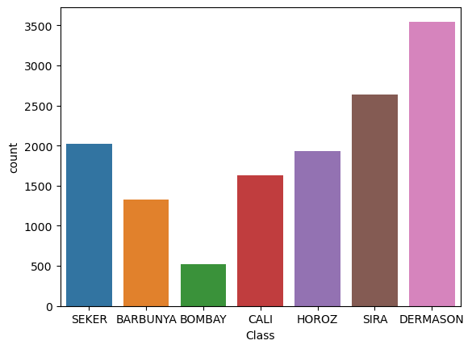
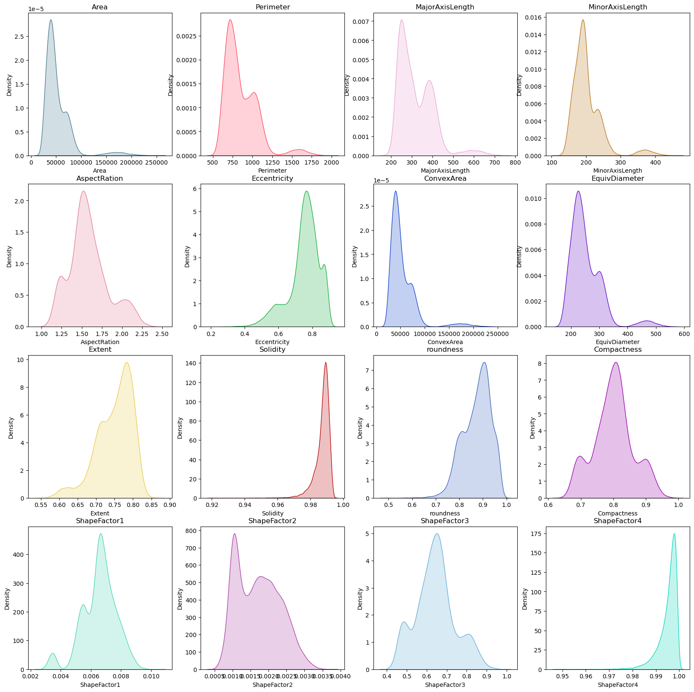
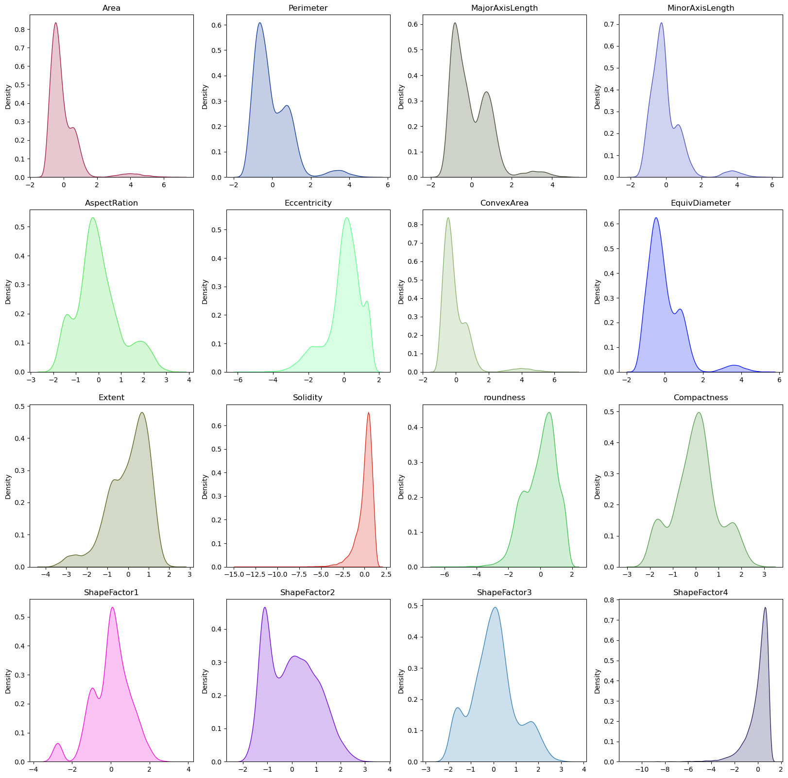
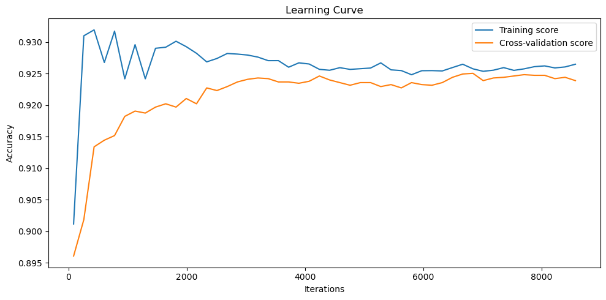

## SVM (Optimization using Randomization)

This is a simple implementation of SVM using randomization. The code is written in Python 3.6. The code is written in a way that it can be easily extended to other optimization algorithms.

## Dataset Used
Dry Bean Dataset from UCI Machine Learning Repository :
[https://archive.ics.uci.edu/ml/datasets/Dry+Bean+Dataset](https://archive.ics.uci.edu/ml/datasets/Dry+Bean+Dataset)

## Initial data distribution
* Count of each class

* Distribution of each feature

| Initial data distribution | Normalized data distribution |
|--------------|------------|
|  |  |

## Results
|   Sample |   Best Accuracy | Best kernel   |   Best Nu |   Best Epsilon |
|---------:|----------------:|:--------------|----------:|---------------:|
|        0 |            0.9  | linear        |      9.94 |           7.29 |
|        1 |            0.92 | linear        |      0.62 |           7.66 |
|        2 |            0.91 | linear        |      5.59 |           2.79 |
|        3 |            0.76 | rbf           |      8.47 |           8.85 |
|        4 |            0.92 | linear        |      1.28 |           0.23 |
|        5 |            0.93 | linear        |      0.28 |           5.2  |
|        6 |            0.91 | linear        |      4.72 |           1.6  |
|        7 |            0.91 | linear        |      4.21 |           4.94 |
|        8 |            0.85 | linear        |      9.17 |           7.65 |
|        9 |            0.92 | linear        |      2.01 |           1.21 |

* Learning curve
